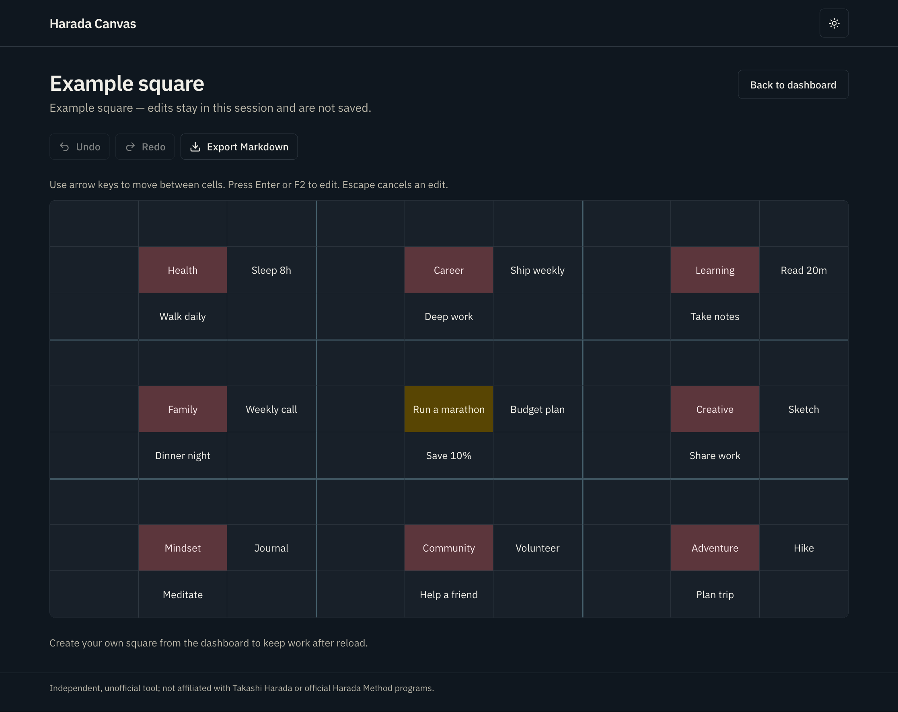

# Harada Canvas

Harada Canvas is an open-source web app for building and managing [Harada Squares](https://en.wikipedia.org/wiki/Harada_Method) for goal planning. It runs entirely in the browser, stores data locally, and is designed for GitHub Pages hosting.

Independent, unofficial tool; not affiliated with Takashi Harada or official Harada Method programs.



## Supported browsers

Latest two major versions of Chrome, Edge, Firefox, and Safari on desktop. Phones and tablets are supported primarily for viewing saved squares; full editing works best on a desktop browser.

## Privacy

- Square contents stay in this browser via `localStorage`.
- Clearing site data for this origin permanently removes saved squares.
- Export a JSON backup before clearing browser storage or switching devices.
- Fonts (IBM Plex Sans) are self-hosted with the app; page loads do not contact Google for typography.

## Accessibility

- Skip link to main content
- Keyboard grid navigation (arrows, Tab, Enter/F2, Escape)
- Visible focus rings and screen-reader labels on controls
- Live announcements for saves, imports, and management actions
- Light and dark themes tuned for WCAG AA contrast
- `prefers-reduced-motion` respected for transitions
- Compact viewports default to a simplified viewing mode with optional editing

## Requirements

- Node.js 22+
- [pnpm](https://pnpm.io/) 10+

## Scripts

```bash
pnpm install
pnpm dev
pnpm test
pnpm typecheck
pnpm check
pnpm build
pnpm preview
```

| Script | Purpose |
| --- | --- |
| `pnpm dev` | Start the Vite development server |
| `pnpm test` | Run the Vitest suite |
| `pnpm test:coverage` | Run tests with coverage |
| `pnpm typecheck` | Type-check the project |
| `pnpm check` | Run Biome format and lint checks |
| `pnpm check:fix` | Apply Biome fixes |
| `pnpm build` | Type-check and create a production build |
| `pnpm preview` | Preview the production build locally |

Production builds default to the GitHub Pages base path `/harada-canvas/`. Override with `VITE_BASE_PATH` when needed:

```bash
VITE_BASE_PATH=/harada-canvas/pr-12/ pnpm build
```

## Local development

1. Install dependencies with `pnpm install`.
2. Start the app with `pnpm dev`.
3. Open the printed local URL.

Hash routing (`#/`, `#/square/:id`) keeps deep links working under GitHub Pages base paths without server rewrites.

## Deployment

Production and pull-request previews are published from the `gh-pages` branch.

| Surface | Trigger | URL shape |
| --- | --- | --- |
| Production | Push to `master` | `https://<owner>.github.io/harada-canvas/` |
| PR preview | Open/sync PR (same-repo only) | `https://<owner>.github.io/harada-canvas/pr-preview/pr-<n>/` |

Preview directories are removed when the pull request closes. Fork pull requests still get CI checks, but they do not receive write-capable preview deploys.

### One-time repository setup

1. Under **Settings → Pages**, set source to **Deploy from a branch**, branch `gh-pages`, folder `/ (root)`.
2. Under **Settings → Actions → General → Workflow permissions**, choose **Read and write permissions** so production and preview workflows can update `gh-pages`.
3. Push to `master` (or merge a PR) to create the first production deploy.

Workflows:

- `.github/workflows/ci.yml` — typecheck, Biome, tests, and build on pull requests and `master`
- `.github/workflows/deploy.yml` — verify, then publish production to `gh-pages` (keeps `pr-preview/`)
- `.github/workflows/pr-preview.yml` — isolated preview build + cleanup via [`rossjrw/pr-preview-action`](https://github.com/rossjrw/pr-preview-action)

## Contributing

1. Create a branch from `master`.
2. Make focused changes with tests for domain and storage behavior.
3. Run `pnpm check`, `pnpm typecheck`, `pnpm test`, and `pnpm build` before opening a pull request.
4. Same-repo pull requests get an automatic Pages preview comment; fork PRs rely on CI only.
5. Keep square contents offline; do not add networked persistence.

## License

MIT
